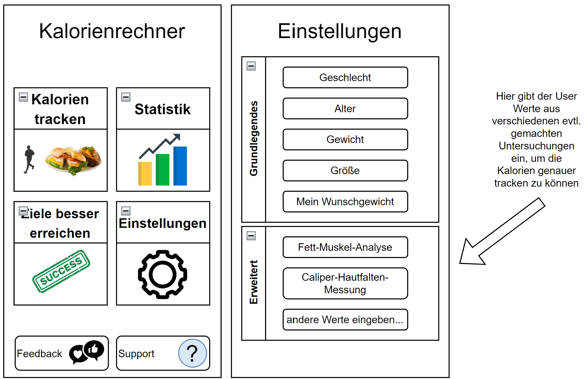
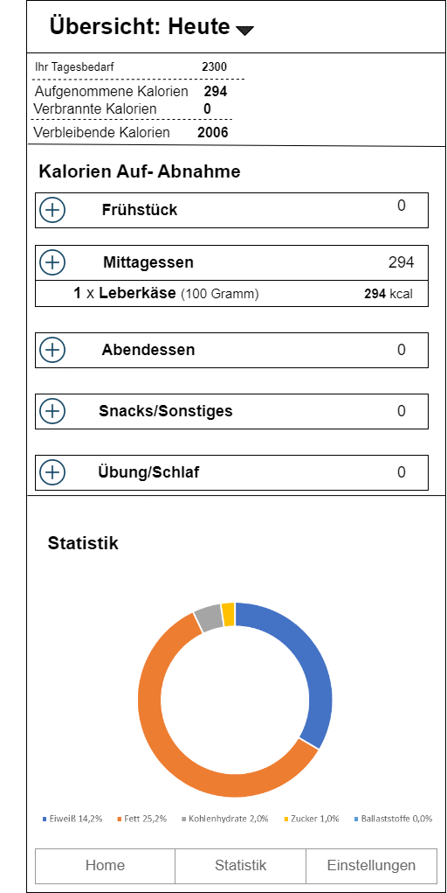

= Calorie counter

== Starten der App

Stellen Sie sicher das sie sich in dem Ordner `CalorieCounter` befinden.
Stellen Sie sicher, dass die Tabellen generiert wurden und schon Beispiels Daten enthalten.

Anschließend führen Sie folgenden Befehl aus: `mvn clean javafx:run`.

Nun sollte sich die App öffnen.

Es gibt jetzt 2 Möglichkeiten:

1. Sie können sich mit dem Benutzer `Max` und dem Passwort `MAXL123` einloggen.
2. Sie können sich neu in der Anwendung registrieren.

== Problem
Viele Menschen wollen ihre Kalorienzunahme mitverfolgen. Jedoch scheitert es oft an der Umständlichkeit sich bei jeder einzelnen Mahlzeit die Kalorien der einzelnen Zutaten zu suchen.

== Aufgabenstellung
Die App soll nicht nur das Mitverfolgen von Kalorien erleichtern. Sondern auch beim Training einsetzbar sein, womit man Menschen zu Sport und Fitness motivieren kann.

== Dokumente
* https://vm81.htl-leonding.ac.at/agiles/99-368/current[Product backlog]
* https://2223-3bhif-syp.github.io/02-projekte-CalorieCounter/[Index]
* https://2223-3bhif-syp.github.io/02-projekte-CalorieCounter/Projektauftrag[Projektauftrag]
* https://2223-3bhif-syp.github.io/02-projekte-CalorieCounter/Klassendiagramm[Klassendiagramm]
* https://2223-3bhif-syp.github.io/02-projekte-CalorieCounter/sysspec[Pflichtenheft]

== Wireframes

.Home & Settings
[%collapsible]
====

====

.Kalorien Übersicht
[%collapsible]
====

====