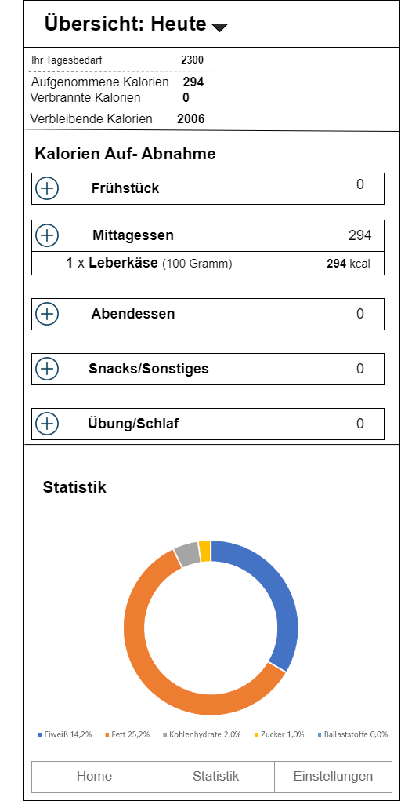
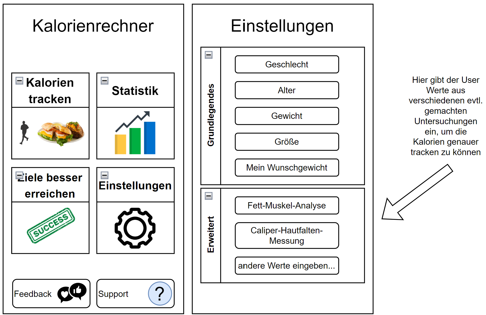

= Pflichtenheft Kalorienrechner
:toc: left
:sectnums:
:toclevels: 1
:table-caption:

Version: 1.0

Version Date: 05-02-2023

Authors:

* f.stroschneider@students.htl-leonding.ac.at
* t.aichinger1@students.htl-leonding.ac.at
* m.gruber4@students.htl-leonding.ac.at
* m.breinesberger@students.htl-leonding.ac.at
//* p.horner@students.htl-leonding.ac.at

== Beschreibung der Ausgangslage

Wir sind ein Team aus 5 Schülern und besuchen die Höhere Technische Bundeslehranstalt Leonding.

== Ist-Zustand

Es gibt derzeit keine Kalorienzähler-App mit den Features, die sich die Leute wünschen.

== Problemstellung

Die Leute neigen dazu, Ihre Kalorien nicht zu zählen und haben keinen Überblick über ihren Kalorienverbrauch und ihre Kalorienaufnahme.
Eine Folge daraus ist es, dass immer mehr Menschen übergewichtig werden.

== Aufgabenstellung

=== Funktionale Anforderungen
==== Use-case diagram
[plantuml,ucd,png]
----
include::plantuml/Usecasediagram.puml[]
----

Das Program soll das aktuelle und das Wunschgewicht abfragen.

Außerdem sollen eingegebene Kalorien gezählt und ausgewertet werden.

Der Benutzer bekommt Vorschläge wie er am effizientesten Kalorien verbrennen kann.

Nach längerer Nutzungszeit sollen Statistiken zur Verfügung stehen.

==== Domain Object Model

[plantuml,cld,png]
----
include::plantuml/Klassendiagramm.puml[]
----

=== Nicht-funktionale Anforderungen

* Sicherheitsanforderung
- Die Daten sollen vor Dritten geschützt werden.

* Zuverlässigkeit
- Das System soll, in einer vorhersehbaren und zuverlässigen Weise zu funktionieren.

* Benutzbarkeit
- Das System soll, so gestaltet werden, dass es einfach und intuitiv von Benutzern verwendet werden kann.

* Effizienz
- Das System soll die Ressourcen effizient nutzen.

* Übertragbarkeit
- Das System soll, auf andere Systeme oder Umgebungen übertragen werden können.

* Wartbarkeit
- Das System soll, Wartungs- und Reparaturarbeiten in einfacher und schneller Weise durchführen können.

=== Wireframes
.Kalorien Übersicht
[%collapsible]
====

====

.Home & Settings
[%collapsible]
====

====

== Zielsetzung

Die Nutzung der App soll Spaß machen und mehr Menschen zu Sport und Fitness motivieren.

== Rahmenbedingungen

Programmiersprache: Java

== Lieferumfang

Der Kunde bekommt eine funktionierende App.

== Administratives

----
Kontakt: f.stroschneider@students.htl-leonding.ac.at

Team: Stroschneider, Gruber, Breinesberger, Aichinger und Horner
----